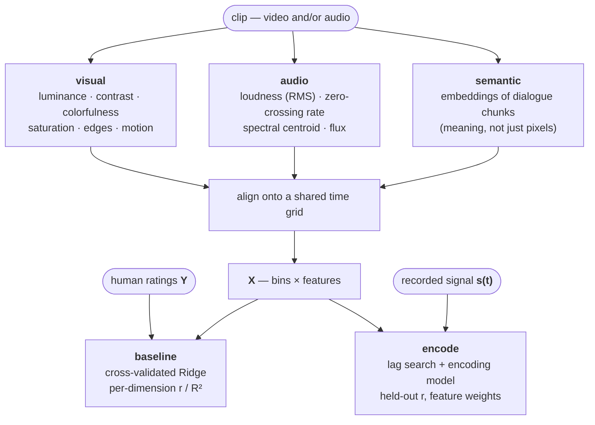

# affectlens

**Extract time-varying features from video, audio, and music — then relate them
to what people felt or what a signal recorded.**


<sub>Frames and features from [*Elephants Dream*](https://orange.blender.org/)
(© 2006 Blender Foundation, CC-BY-2.5), one of the linked sample clips — fetch
them with `python scripts/fetch_samples.py`, regenerate the figures with
`python scripts/make_readme_figures.py`.</sub>

`affectlens` turns a folder of clips into aligned feature time courses and gives
you two ready-made ways to use them:

1. **Predict human ratings** — reproduce continuous behavioral ratings (energy,
   arousal, brightness, whatever your raters scored) from the clip content, with
   an honest cross-validated score.
2. **Explain a recorded signal** — correlate the feature time courses against a
   separately recorded continuous signal (a physiological or neuroimaging channel
   — an EEG band envelope, an fMRI ROI time series, pupil size, heart rate) and
   fit an encoding model that says *which features drive the signal*.

It handles the unglamorous parts for you: decoding video/audio (a working ffmpeg
is bundled, no system install), computing features on each medium's natural
clock, and resampling everything onto one shared time grid so your design matrix
and your target line up row-for-row.



## Install

```bash
pip install affectlens          # from PyPI (once published)
# or, from a checkout:
pip install -e .
```

`imageio-ffmpeg` ships a static ffmpeg, so there is nothing else to install to
decode video and audio.

## Quick start

```bash
# 1. What's in my clips folder? (durations, resolution, audio/video streams)
affectlens inventory --clips data/clips

# 2. Reproduce human ratings from the clips (leave-one-clip-out CV):
affectlens baseline --clips data/clips --ratings data/ratings.csv

# 3. Write the aligned feature matrices to disk. --ratings is optional: with
#    it, features are binned on the rating grid; without it, on a
#    duration-derived grid (all you need for `encode`):
affectlens extract --clips data/clips --out out/

# 4. Relate those features to a recorded signal (e.g. a brain channel):
affectlens encode --features out/clip_01__features.csv \
                  --signal data/brain_signal.csv --lags 0,1,2

# Kick the tires with no data at all — generates synthetic clips and runs the
# whole pipeline end-to-end:
affectlens selftest
```

Here is step 4 on real data — a demo "recording" built from the sample film's
own loudness delayed by one 4.5 s bin (plus noise). The lag scan recovers the
delay, and the model's top weight lands on the true driving feature:


### As a library

```python
from affectlens import pipeline, ExtractionConfig
from affectlens import encoding

# Extract + score against ratings.
per_clip, result = pipeline.run("data/clips", "data/ratings.csv")
print(result.to_frame())          # per-rated-dimension Pearson r / R²

# Relate one clip's features to a recorded signal.
X = per_clip[0].X                 # bins × features, indexed by bin start time
signal = encoding.bin_signal(times, values, X.index.to_numpy(), interval_s=4.5)
enc = encoding.encode_signal(X, signal, lag_bins=1)
print(enc.r, enc.weights[:5])     # held-out r, and the features that drive it
```

## Inputs

- **Clips** — a directory of video (`.mp4`, `.mov`, `.mkv`, …) or **audio-only**
  files (`.wav`, `.mp3`, `.flac`, …). Audio-only clips (e.g. music) yield audio
  features only; silent video yields visual features only.
- **Ratings** (optional) — CSV or Excel. Layout is flexible: wide (one column per
  rated dimension) or long (feature/value columns), a single combined file or one
  file per participant. Column names are auto-detected and can be pinned
  explicitly with `RatingSchema`. Per-participant ratings are averaged to a
  consensus target, keeping an `n_raters` count.
- **Dialogue** (optional, for semantic features) — a subtitle sidecar
  (`clip.srt` / `.vtt`) or `clip.csv` with `t_start,t_end,text` next to each clip.
  The transcription and embedding steps are swappable interfaces (see below).
- **Signal** (optional, for `encode`) — CSV with a time column and a value column.

## Features

| Family | What it captures | Where |
| --- | --- | --- |
| Visual (low-level) | luminance, contrast, colorfulness, saturation, edge density, motion | `lowlevel.py` |
| Audio (low-level) | loudness (RMS), zero-crossing rate, spectral centroid, spectral flux | `lowlevel.py` |
| Semantic (high-level) | embeddings of dialogue chunks — tracks *meaning*, not pixels | `highlevel.py` |

Within each rating bin every stream is aggregated with **mean, std, and max**, so
a coarse time grid still carries sharp within-bin events (a surprise, an energy
spike) — the `*_max` / `*_std` columns retain them.

### Swappable semantic backends

The high-level path is built as two small interfaces so the heavy pieces drop in
cleanly and the pipeline still runs fully offline by default:

- **Transcriber** — clip → time-stamped dialogue. Default reads a subtitle
  sidecar; swap in Whisper / faster-whisper for real ASR (`pip install
  affectlens[asr]`).
- **Embedder** — text → vector. Default is a deterministic hashed bag-of-words
  (no network, for testing); swap in sentence-transformers or an embedding API
  for real semantics (`pip install affectlens[semantic]`).

Nothing downstream changes when you swap them.

## Why the design looks like this

- **One shared time base.** Human ratings and most recorded signals are sampled
  slowly and irregularly. Everything is resampled onto the rating/feature grid so
  correlation and regression are apples-to-apples.
- **Cross-validated, interpretable baselines.** Ridge with leave-one-clip-out
  folds is the honest "predict an unseen clip" test, and its per-feature weights
  say *why*. It's the number a fancier model has to beat.
- **Lag-aware encoding.** A recorded response often trails the stimulus by a
  fixed delay (an fMRI hemodynamic response peaks seconds later). `encode`/
  `correlate` scan lags so you find that delay instead of missing the signal.

## Development

```bash
pip install -e ".[dev]"
pytest
```

The test suite generates real synthetic clips and runs the whole pipeline
end-to-end, so a green run means video decode, feature extraction, alignment,
rating baseline, and signal encoding all work.

## License

MIT — see [LICENSE](LICENSE).
