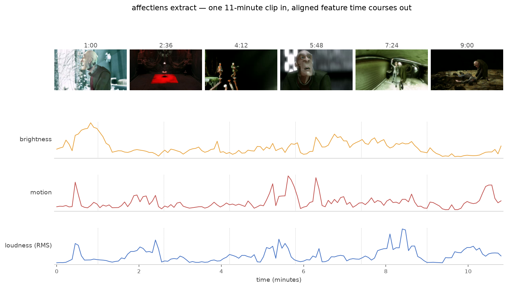
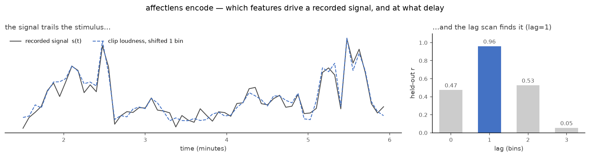

# affectlens

**Extract time-varying features from video, audio, and music — then relate them
to what people rated or what a signal recorded.**



<sub>Frames and features from [*Elephants Dream*](https://orange.blender.org/)
(© 2006 Blender Foundation, CC-BY-2.5), one of the linked sample clips — fetch
them with `python scripts/fetch_samples.py`, regenerate the figures with
`python scripts/make_readme_figures.py`.</sub>

`affectlens` turns a folder of clips into aligned feature time courses and gives
you two ready-made ways to use them:

1. **Predict human ratings** — score how well clip content predicts continuous
   behavioral ratings you supply (energy, arousal, brightness, whatever your
   raters scored), with leave-one-clip-out cross-validation.
2. **Explain a recorded signal** — correlate the feature time courses against a
   separately recorded continuous signal (a physiological or neuroimaging channel
   — an EEG band envelope, an fMRI ROI time series, pupil size, heart rate) and
   fit a cross-validated encoding model that both predicts the signal on held-out
   data and ranks *which features the response leans on*.

The features span the range you'd want as regressors — low-level physical
(luminance, motion, loudness, spectral shape) through high-level semantic (what
the dialogue means).

It handles the unglamorous parts for you: decoding video/audio (a static ffmpeg
ships with it via `imageio-ffmpeg`, no system install), computing features on
each medium's natural clock, and resampling everything onto one shared time grid
so your design matrix and your target line up row-for-row.


<!-- Diagram source: docs/images/pipeline.mmd (regenerate with the command noted there). -->

The pipeline in words: a **clip** fans out into **visual**, **audio**, and
**semantic** feature families; those **align onto a shared time grid** to form
the design matrix **X** (bins × features). From there, two workflows: a
cross-validated **baseline** that predicts human ratings **Y**, and an
**encode** step that relates the features to a separately recorded signal
**s(t)** with a lag search.

## Does the pipeline work?

These are **sanity checks on public footage** — they show the machinery is wired
correctly. They are *not* a validation against real recordings: affectlens has
not yet been run on real physiological or neural data, and how well features
explain *your* signal is the empirical question you'd bring your own data for.

**It runs end-to-end.** The test suite generates programmatic test clips and
drives the entire chain — video/audio decode → feature extraction → time-grid
alignment → rating baseline → signal encoding. A green run means every stage
works together, not just that the modules import.

**It recovers a dependence it was never told about.** On a real 11-minute film,
we build a mock "recording" from the clip's *own* loudness delayed by one 4.5 s
bin, add noise, and hand it to `encode` blind. With **contiguous** cross-validation
(temporally-adjacent bins never split across train/test, so nothing leaks), the
lag scan peaks at the planted delay and the model concentrates its weight on the
one feature the signal was built from:

| lag (bins) | 0 | **1** | 2 | 3 |
| --- | --- | --- | --- | --- |
| held-out *r* | 0.47 | **0.96** | 0.53 | 0.05 |

The robust, reseed-stable result is qualitative: **the scan finds the right lag
(1) and the right feature (`audio__rms_mean`), every time.** The peak held-out
*r* ≈ 0.96 sits near the noise ceiling set by the noise we added — it says the
plumbing recovers a known signal at the right delay, nothing more.



Swap the mock recording for a real signal (an EEG band envelope, an fMRI ROI
time course, pupil size) and `encode` relates your features to it the same way —
reporting a held-out *r*, so you can ask both *"which features does the response
lean on?"* and *"how well can I predict it?"*

Reproduce the whole thing from scratch — public sample clips, one fixed-seed
script, no private data:

```bash
pip install -e ".[dev]" matplotlib
python scripts/fetch_samples.py                       # linked CC/public clips
affectlens extract --clips examples/samples --out out/
python scripts/make_readme_figures.py                 # regenerates the figures here
```

## Install

```bash
pip install affectlens          # from PyPI (once published)
# or, from a checkout:
pip install -e .
```

`imageio-ffmpeg` ships a static ffmpeg, so there is nothing else to install to
decode video and audio.

## Quick start

```bash
# 1. What's in my clips folder? (durations, resolution, audio/video streams)
affectlens inventory --clips data/clips

# 2. Reproduce human ratings from the clips (leave-one-clip-out CV):
affectlens baseline --clips data/clips --ratings data/ratings.csv

# 3. Write the aligned feature matrices to disk. --ratings is optional: with
#    it, features are binned on the rating grid; without it, on a
#    duration-derived grid (all you need for `encode`):
affectlens extract --clips data/clips --out out/

# 4. Relate those features to a recorded signal (e.g. a brain channel):
affectlens encode --features out/clip_01__features.csv \
                  --signal data/brain_signal.csv --lags 0,1,2

# Kick the tires with no data at all — generates synthetic clips and runs the
# whole pipeline end-to-end:
affectlens selftest
```

(Step 4 is the sanity check shown in [Does the pipeline work?](#does-the-pipeline-work)
above, run on a real film. The CLI's `--lags 0,1,2` *scans* those lags; the
library's `lag_bins=1` fixes one — same machinery, two entry points.)

### As a library

```python
from affectlens import pipeline, ExtractionConfig
from affectlens import encoding

# Extract + score against ratings.
per_clip, result = pipeline.run("data/clips", "data/ratings.csv")
print(result.to_frame())          # per-rated-dimension Pearson r / R²

# Relate one clip's features to a recorded signal.
X = per_clip[0].X                 # bins × features, indexed by bin start time
signal = encoding.bin_signal(times, values, X.index.to_numpy(), interval_s=4.5)
enc = encoding.encode_signal(X, signal, lag_bins=1)
print(enc.r, enc.weights[:5])     # held-out r, and the features that drive it
```

## Inputs

- **Clips** — a directory of video (`.mp4`, `.mov`, `.mkv`, …) or **audio-only**
  files (`.wav`, `.mp3`, `.flac`, …). Audio-only clips (e.g. music) yield audio
  features only; silent video yields visual features only.
- **Ratings** (optional) — CSV or Excel. Layout is flexible: wide (one column per
  rated dimension) or long (feature/value columns), a single combined file or one
  file per participant. Column names are auto-detected and can be pinned
  explicitly with `RatingSchema`. Per-participant ratings are averaged to a
  consensus target, keeping an `n_raters` count.
- **Dialogue** (optional, for semantic features) — a subtitle sidecar
  (`clip.srt` / `.vtt`) or `clip.csv` with `t_start,t_end,text` next to each clip.
  The transcription and embedding steps are swappable interfaces (see below).
- **Signal** (optional, for `encode`) — CSV with a time column and a value
  column. Timestamps must be in seconds relative to clip onset, and `interval_s`
  must match the feature bin width. `encode` operates on one clip's features at a
  time; to model a whole run, concatenate the per-clip feature matrices and the
  signal in the same bin order.

## Features

| Family | What it captures | Where |
| --- | --- | --- |
| Visual (low-level) | luminance, contrast, colorfulness, saturation, edge density, motion | `lowlevel.py` |
| Audio (low-level) | loudness (RMS), zero-crossing rate, spectral centroid, spectral flux | `lowlevel.py` |
| Semantic (high-level) | text features from dialogue (default: hashed bag-of-words; optional sentence-transformer embeddings for true semantic similarity) | `highlevel.py` |

Within each rating bin every stream is aggregated with **mean, std, and max**, so
a coarse time grid still carries sharp within-bin events (a surprise, an energy
spike) — the `*_max` / `*_std` columns retain them.

**Where does affect/emotion come in?** affectlens does not read emotion off the
pixels. Affect enters two ways, both honest: as **semantic** regressors
(dialogue-based text features), and via the **ratings path** — supply affect
ratings (arousal, valence, …) and the baseline scores how well clip content
predicts them and which features carry them. Either can then be correlated with
a recorded signal through `encode`.

### Swappable semantic backends

The high-level path is built as two small interfaces so the heavy pieces drop in
cleanly and the pipeline still runs fully offline by default:

- **Transcriber** — clip → time-stamped dialogue. Default reads a subtitle
  sidecar; swap in Whisper / faster-whisper for real ASR (`pip install
  affectlens[asr]`).
- **Embedder** — text → vector. Default is a deterministic hashed bag-of-words
  (no network, for testing); swap in sentence-transformers or an embedding API
  for real semantics (`pip install affectlens[semantic]`).

Nothing downstream changes when you swap them.

## Why the design looks like this

- **One shared time base.** Human ratings and most recorded signals are sampled
  slowly and irregularly. Everything is resampled onto the rating/feature grid so
  correlation and regression are apples-to-apples.
- **Cross-validated, interpretable baselines.** Ridge with leave-one-clip-out
  folds is the honest "predict an unseen clip" test, and its per-feature weights
  say *why*. It's the number a fancier model has to beat.
- **Lag-aware encoding.** A recorded response often trails the stimulus by a
  fixed delay (an fMRI hemodynamic response peaks seconds later). `encode`/
  `correlate` scan a few integer-bin lags so you find that delay instead of
  missing the signal. This is a crude stand-in for a response delay, not an HRF
  model — no convolution, no continuous kernel; a first pass, not the last word.

## Development

```bash
pip install -e ".[dev]"
pytest
```

The suite generates programmatic test clips and exercises the whole pipeline
end-to-end (decode → features → alignment → baseline → encoding) — see
[Does the pipeline work?](#does-the-pipeline-work) for what a green run buys you.

## License

MIT — see [LICENSE](LICENSE).
