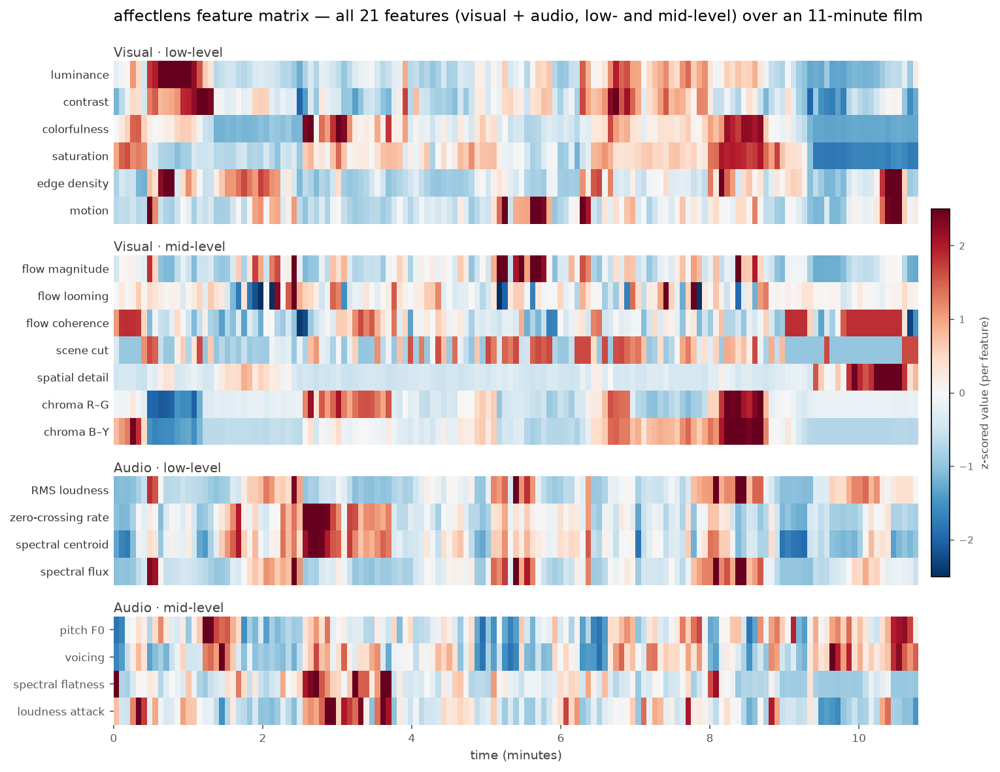
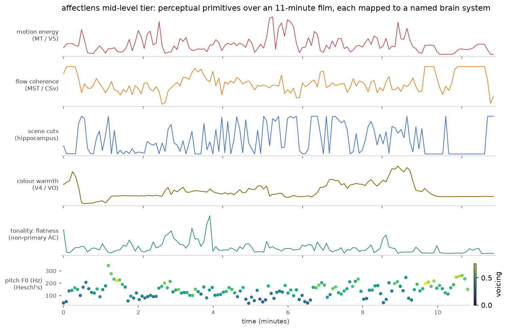

# affectlens

**A toolkit for turning naturalistic video, audio, and music into aligned
feature time courses, and relating those features to continuous human ratings or
a recorded neural / physiological signal.**

`affectlens` implements the stimulus side of a *voxelwise encoding-model* workflow
[[1](#references), [2](#references)]: it extracts time-varying **feature spaces**
from a clip (low-level physical statistics, mid-level perceptual primitives, and
high-level dialogue semantics), resamples them onto one shared time grid, and
fits cross-validated linear models that (a) predict continuous ratings or (b)
predict a separately recorded signal with a lag search — reporting held-out
prediction accuracy and *which features the response leans on*.


<sub>Frames above mid-level feature time courses — motion energy (MT/V5), scene
cuts (hippocampus), colour warmth (V4/VO), sound onsets (startle) — from
[*Elephants Dream*](https://orange.blender.org/) (© 2006 Blender Foundation,
CC-BY-2.5), one of the linked sample clips. Fetch them with `python
scripts/fetch_samples.py`; regenerate every figure in this README with `python
scripts/make_readme_figures.py`.</sub>

---

**Contents** — [Background](#background) · [Pipeline](#pipeline) ·
[Feature spaces](#feature-spaces) · [Mid-level tier](#the-mid-level-tier) ·
[Methods](#methods) · [Machinery validation](#results--machinery-validation) ·
[Install & usage](#install) · [Inputs](#inputs) · [Roadmap](#roadmap) ·
[References](#references)

---

## Background

When a person watches a film or listens to music, the stimulus varies
continuously and so does the response — a behavioral rating dial, an EEG band
envelope, an fMRI ROI time course, pupil size, heart rate. The **encoding-model**
paradigm relates the two by describing the stimulus as one or more *feature
spaces* — each a hypothesis about what information drives the response — and
fitting a regularized linear model that predicts the measured signal from those
features, evaluated by its accuracy on **held-out** data [[1](#references)]. A
feature space that predicts held-out responses is *evidence that the information
it encodes is represented*, not proof of mechanism; this is the discipline the
field holds itself to [[1](#references), [2](#references)].

`affectlens` is the front half of that workflow — feature extraction and
alignment — with two ready-made back halves:

1. **Predict human ratings.** Score how well clip content predicts continuous
   behavioral ratings you supply (arousal, energy, brightness, whatever your
   raters scored), with leave-one-clip-out cross-validation.
2. **Explain a recorded signal.** Relate the feature time courses to a separately
   recorded continuous signal and fit a cross-validated encoding model that both
   predicts the signal on held-out data and ranks which features it leans on.

It handles the unglamorous parts: decoding video/audio (a static ffmpeg ships via
`imageio-ffmpeg`, no system install), computing features on each medium's natural
clock, and resampling everything onto one shared time grid so the design matrix
and the target line up row-for-row.

## Pipeline


<!-- Diagram source: docs/images/pipeline.mmd (regenerate with the command noted there). -->

A **clip** fans out into **visual**, **audio**, and **semantic** feature spaces;
those **align onto a shared time grid** to form the design matrix **X** (bins ×
features). From there, two workflows: a cross-validated **baseline** that
predicts human ratings **Y**, and an **encode** step that relates the features to
a separately recorded signal **s(t)** with a lag search.

## Feature spaces

Features span three tiers, from raw physical statistics to dialogue meaning. The
tiering is the design contribution: **each mid-level feature is chosen to index a
named, testable brain system**, so a feature-to-signal correlation is
interpretable rather than diffuse. (This mapping is a hypothesized framing to
guide analysis, not a claim of established localization.)

| Tier | Feature space | Module |
| --- | --- | --- |
| Low-level visual | luminance, contrast, colorfulness, saturation, edge density, motion | `lowlevel.py` |
| Low-level audio | loudness (RMS), zero-crossing rate, spectral centroid, spectral flux | `lowlevel.py` |
| **Mid-level** | optical-flow motion / looming / coherence, scene cuts, spatial detail, colour opponency; pitch + voicing, spectral flatness, loudness attack | `midlevel.py` |
| High-level semantic | text features from dialogue (default: hashed bag-of-words; optional sentence-transformer embeddings) | `highlevel.py` |

Within each time bin every stream is aggregated with **mean, std, and max**, so a
coarse grid still carries sharp within-bin events (a surprise, an energy spike):
the `*_max` / `*_std` columns retain them.

Extraction turns each clip into exactly this **design matrix** — every feature as
a time course on one shared grid, the input both workflows consume:



<sub>All 21 base features (mean-aggregated; `scene_cut` at its within-bin max),
z-scored per feature, over *Elephants Dream*. This is the whole feature space
`extract` produces — low- and mid-level, visual and audio — and the matrix the
baseline and encoding models read row-for-row against your target.</sub>

### The mid-level tier

Between raw physical statistics and dialogue meaning sits a band of **perceptual
primitives** — motion structure, pitch, scene cuts, spectral texture, colour
opponency. `affectlens` ships nine (spanning eleven feature columns), all pure
`numpy` / OpenCV with **no extra dependency**, each computed inside a decode pass
the pipeline already makes (the per-frame visual loop or the 50 ms / 25 ms audio
window loop), so the whole tier is close to free.



| Feature | Column(s) | What it captures | Maps to (ref.) | Closest existing feature, and the distinction |
| --- | --- | --- | --- | --- |
| Optical-flow motion | `flow_magnitude` | mean flow speed = real motion energy | MT / V5 [[4](#references)] | `motion` is a frame-difference that also fires on lighting/cuts; flow is true velocity |
| Looming | `flow_looming` | radial expansion (approach) vs. contraction (recede) | MSTd [[5](#references)] | a *signed radial* component, not present elsewhere |
| Flow coherence | `flow_coherence` | global self-motion (camera pan) vs. local object motion, in [0, 1] | MT surround / MST / CSv [[6](#references)] | direction *agreement*, independent of speed (`flow_magnitude`) and radial sign (`flow_looming`) |
| Scene cuts | `scene_cut` | shot-boundary score, spikes at hard cuts | hippocampal / event-segmentation network [[9](#references)] | histogram change, robust where a pixelwise diff is not |
| Spatial detail | `spatial_detail` | high-spatial-frequency energy (Laplacian variance) | V1 spatial-frequency channels [[7](#references)] | `edge_density` is a thresholded *count*; `contrast` is coarse layout — this is continuous fine-scale energy |
| Colour opponency | `chroma_rg`, `chroma_by` | signed red–green and blue–yellow balance | cone-opponent axes; V4 / VO [[8](#references)] | `saturation` / `colorfulness` are unsigned magnitude — this is the *sign* they discard |
| Pitch | `pitch_f0`, `voicing` | fundamental frequency (Hz) and periodicity strength | anterolateral Heschl's gyrus [[10](#references)] | `spectral_centroid` is energy location, not periodicity |
| Spectral flatness | `spectral_flatness` | tonal vs. noise-like texture (Wiener entropy) in [0, 1] | non-primary auditory cortex [[12](#references)] | `voicing` is band-limited periodicity; this needs no pitch assumption |
| Loudness attack | `loudness_attack` | rectified positive rise in loudness (dB) | brainstem acoustic-startle arc [[11](#references)] | `spectral_flux` is symmetric and timbre-sensitive; this fires on intensity *rises* only |

**The flow features are a basis, not overlaps.** They are a first-order
decomposition of the same optical-flow field: mean speed (`flow_magnitude`),
radial divergence (`flow_looming`), and translational coherence
(`flow_coherence`) occupy orthogonal axes, and MT vs. MSTd vs. MST/CSv are
functionally dissociable populations [[4](#references)–[6](#references)].

**Two mappings are deliberately loose, and we say so.** "Warm vs. cool" colour is
a perceptual / aesthetic grouping imposed on the cardinal cone-opponent axes, not
a canonical neural dimension — the defensible substrate is the opponent axes
themselves [[8](#references)]. Spectral flatness has no dedicated cortical region;
it stands in as an *indirect proxy* for spectral-regularity / harmonicity
sensitivity and is confounded with pitch [[12](#references)]. Every feature is
robust by construction: it is defined on flat frames, silence, the first
frame / window, and all-zero spectra (explicit gates / eps floors — no NaN, no
crash), which the test suite checks.

**Where does affect / emotion come in?** `affectlens` does not read emotion off
the pixels. Affect enters two honest ways: as **semantic** regressors
(dialogue-based text features), and via the **ratings path** — supply affect
ratings (arousal, valence, …) and the baseline scores how well clip content
predicts them and which features carry them. Either can then be correlated with a
recorded signal through `encode`.

### Swappable semantic backends

The high-level path is two small interfaces, so the heavy pieces drop in cleanly
and the pipeline still runs fully offline by default:

- **Transcriber** — clip → time-stamped dialogue. Default reads a subtitle
  sidecar; swap in Whisper / faster-whisper for real ASR (`pip install affectlens[asr]`).
- **Embedder** — text → vector. Default is a deterministic hashed bag-of-words
  (no network, for testing); swap in sentence-transformers or an embedding API
  for real semantics (`pip install affectlens[semantic]`).

Nothing downstream changes when you swap them.

## Methods

- **One shared time base.** Ratings and most recorded signals are sampled slowly
  and irregularly. Every feature stream — each on its own fast clock — is
  aggregated (mean / std / max) into the rating/feature bins, so correlation and
  regression are apples-to-apples.
- **Cross-validated, interpretable baselines.** Ridge regression with grouped
  (leave-one-clip-out) folds is the honest "predict an unseen clip" test — a
  clear reference a fancier model has to beat. Weights are an importance ranking,
  **not** a clean causal attribution: naturalistic feature spaces are highly
  collinear, and ridge spreads weight across correlated features.
- **Lag-aware encoding.** A recorded response usually trails the stimulus by a
  fixed delay (an fMRI hemodynamic response peaks seconds later). `encode` scans a
  few integer-bin lags to find it.

> **On the response lag — a deliberate first-order stand-in, not the field
> standard.** A single fixed integer-bin delay samples one point on the response
> and cannot represent its rise, dispersion, and undershoot, nor adapt to
> region- or subject-varying latency; a mis-set lag attenuates the predicted *r*
> and can misattribute variance across correlated feature spaces. The principled
> upgrades are canonical / estimated **HRF convolution**, a **multi-delay FIR**
> model (a separate weight per feature × delay, the encoding-model default
> [[2](#references)]), or IRF deconvolution for continuous behavioral ratings.
> `encode` is a first pass, not the last word.

For fitting a whole recording, concatenate the per-clip feature matrices and the
signal in the same bin order; per-feature-space regularization (banded ridge
[[3](#references)]) is the natural next step across these tiered spaces.

## Results — machinery validation

These are **sanity checks on public footage** — they show the machinery is wired
correctly. They are *not* a validation against real recordings: `affectlens` has
not yet been run on real physiological or neural data, and how well features
explain *your* signal is the empirical question you would bring your own data for.

**It runs end-to-end.** The test suite generates programmatic clips and drives
the entire chain — video/audio decode → feature extraction → time-grid alignment
→ rating baseline → signal encoding — plus unit checks on every mid-level feature
(a 220 Hz tone reads as tonal / low-flatness and noise as high-flatness, a
uniform pan as high-coherence and scrambled motion as low, a red frame as warm,
silence and flat frames as finite). A green run means every stage works together.

**It recovers a dependence it was never told about.** On the real 11-minute film,
we build a mock "recording" from the clip's *own* loudness delayed by one 4.5 s
bin, add noise, and hand it to `encode` blind. With **contiguous**
cross-validation (temporally adjacent bins never split across train/test, so
nothing leaks), the lag scan peaks at the planted delay and the model
concentrates its weight on the one feature the signal was built from
(`audio__rms_mean`), out of all 63:

| lag (bins) | 0 | **1** | 2 | 3 |
| --- | --- | --- | --- | --- |
| held-out *r* | 0.42 | **0.93** | 0.55 | 0.26 |


The robust, reseed-stable result is qualitative: **the scan finds the right lag
(1) and the right feature every time.** The peak *r* sits near the ceiling set by
the noise we added — it says the plumbing recovers a known signal at the right
delay, nothing more. Swap the mock recording for a real signal and `encode`
relates your features to it the same way.

Reproduce the whole thing from scratch — public sample clips, one fixed-seed
script, no private data:

```bash
pip install -e ".[dev]" matplotlib
python scripts/fetch_samples.py                       # linked CC / public clips
affectlens extract --clips examples/samples --out out/
python scripts/make_readme_figures.py                 # regenerates the figures here
```

## Install

```bash
pip install affectlens          # from PyPI (once published)
# or, from a checkout:
pip install -e .
```

`imageio-ffmpeg` ships a static ffmpeg, so there is nothing else to install to
decode video and audio.

## Quick start

```bash
# 1. What's in my clips folder? (durations, resolution, audio/video streams)
affectlens inventory --clips data/clips

# 2. Reproduce human ratings from the clips (leave-one-clip-out CV):
affectlens baseline --clips data/clips --ratings data/ratings.csv

# 3. Write the aligned feature matrices to disk. --ratings is optional: with it,
#    features are binned on the rating grid; without it, on a duration-derived
#    grid (all you need for `encode`):
affectlens extract --clips data/clips --out out/

# 4. Relate those features to a recorded signal (e.g. a brain channel):
affectlens encode --features out/clip_01__features.csv \
                  --signal data/brain_signal.csv --lags 0,1,2

# Kick the tires with no data at all — generates synthetic clips and runs the
# whole pipeline end-to-end:
affectlens selftest
```

> **New here?** Two gentle ways in, no CLI needed:
> - the guided notebook
>   [`examples/getting_started.ipynb`](examples/getting_started.ipynb) — the whole
>   pipeline on the sample clips with a plot and a plain-English note at each step
>   (`pip install -e ".[notebook]"`);
> - a point-and-click web app — `pip install -e ".[webui]"` then
>   `streamlit run webui/app.py` — pick a clip, plot its features, relate them to
>   an uploaded signal, with a tooltip explaining every feature.

### As a library

```python
from affectlens import pipeline, ExtractionConfig
from affectlens import encoding

# Extract + score against ratings.
per_clip, result = pipeline.run("data/clips", "data/ratings.csv")
print(result.to_frame())          # per-rated-dimension Pearson r / R²

# Relate one clip's features to a recorded signal.
X = per_clip[0].X                 # bins × features, indexed by bin start time
signal = encoding.bin_signal(times, values, X.index.to_numpy(), interval_s=4.5)
enc = encoding.encode_signal(X, signal, lag_bins=1)
print(enc.r, enc.weights[:5])     # held-out r, and the features the response leans on
```

## Inputs

- **Clips** — a directory of video (`.mp4`, `.mov`, `.mkv`, …) or **audio-only**
  files (`.wav`, `.mp3`, `.flac`, …). Audio-only clips (e.g. music) yield audio
  features only; silent video yields visual features only.
- **Ratings** (optional) — CSV or Excel. Layout is flexible: wide (one column per
  rated dimension) or long (feature/value columns), a single combined file or one
  file per participant. Column names are auto-detected and can be pinned with
  `RatingSchema`. Per-participant ratings are averaged to a consensus target,
  keeping an `n_raters` count.
- **Dialogue** (optional, for semantic features) — a subtitle sidecar
  (`clip.srt` / `.vtt`) or `clip.csv` with `t_start,t_end,text` next to each clip.
- **Signal** (optional, for `encode`) — CSV with a time column and a value column.
  Timestamps in seconds relative to clip onset; `interval_s` must match the
  feature bin width. `encode` operates on one clip's features at a time; to model
  a whole run, concatenate per-clip feature matrices and the signal in bin order.

## Roadmap

The mid-level band is wide open, and that is the point. Each idea below is one
small extractor (a function returning a `t`-column DataFrame); the heavier ones
would ship as optional extras. A sample of what is tractable and where it lands:

- **Visual:** face presence / count / size (→ FFA / OFA / STS), facial-motion
  dynamism (→ posterior STS), scene / place category (→ PPA / RSC), animacy
  occupancy (→ ventral temporal).
- **Audio:** speech envelope / amplitude modulation (→ STG speech tracking),
  voice-activity detection (→ temporal voice areas), tempo / beat / onset density
  (→ auditory + SMA / basal ganglia).
- **Semantic / cross-modal:** word surprisal (→ language network / N400), topic
  and narrative-boundary segmentation (→ hippocampus / DMN), dialogue sentiment
  (→ vmPFC / OFC).

See [`src/affectlens/midlevel.py`](src/affectlens/midlevel.py) for the full
roadmap with brain-system targets.

## Development

```bash
pip install -e ".[dev]"
pytest
```

The suite generates programmatic clips and exercises the whole pipeline
end-to-end (decode → features → alignment → baseline → encoding), plus unit tests
for each mid-level feature — see [Machinery validation](#results--machinery-validation)
for what a green run buys you.

## References

The brain-system mappings above are drawn from the following primary and review
sources. They motivate the feature-to-region hypotheses; they do not constitute a
validation of `affectlens` on neural data.

1. Naselaris, T., Kay, K. N., Nishimoto, S., & Gallant, J. L. (2011). Encoding and decoding in fMRI. *NeuroImage*, 56(2), 400–410.
2. Dupré la Tour, T., Visconti di Oleggio Castello, M., & Gallant, J. L. (2025). The Voxelwise Encoding Model framework: a tutorial introduction. *Imaging Neuroscience*.
3. Nunez-Elizalde, A. O., Huth, A. G., & Gallant, J. L. (2019). Voxelwise encoding models with non-spherical multivariate normal priors. *NeuroImage*, 197, 482–492. (banded ridge; see also Dupré la Tour et al., 2022, *NeuroImage* 264, 119728.)
4. Newsome, W. T., & Paré, E. B. (1988). A selective impairment of motion perception following lesions of area MT/V5. *J. Neurosci.*, 8(6), 2201–2211. Born, R. T., & Bradley, D. C. (2005). Structure and function of visual area MT. *Annu. Rev. Neurosci.*, 28, 157–189.
5. Duffy, C. J., & Wurtz, R. H. (1991). Sensitivity of MST neurons to optic flow stimuli. *J. Neurophysiol.*, 65(6), 1329–1345. Billington, J., et al. (2011). Neural processing of imminent collision in humans. *J. Cogn. Neurosci.*, 23(8).
6. Born, R. T., & Tootell, R. B. H. (1992). Segregation of global and local motion processing in primate area MT. *Nature*, 357, 497–499. Wall, M. B., & Smith, A. T. (2008). The representation of egomotion in the human brain. *Curr. Biol.*, 18(3), 191–194.
7. De Valois, R. L., Albrecht, D. G., & Thorell, L. G. (1982). Spatial frequency selectivity of cells in macaque visual cortex. *Vision Research*, 22(5), 545–559. Henriksson, L., et al. (2008). Spatial frequency tuning in human retinotopic visual areas. *NeuroImage*, 40(3), 1174–1183.
8. Conway, B. R., Moeller, S., & Tsao, D. Y. (2007). Specialized color modules in macaque extrastriate cortex. *Neuron*, 56(3), 560–573. Brouwer, G. J., & Heeger, D. J. (2009). Decoding and reconstructing color from responses in human visual cortex. *J. Neurosci.*, 29(44), 13992–14003.
9. Baldassano, C., et al. (2017). Discovering event structure in continuous narrative perception and memory. *Neuron*, 95(3), 709–721. Ben-Yakov, A., & Henson, R. N. (2018). The hippocampal film editor. *J. Neurosci.*, 38(47), 10057–10068.
10. Bendor, D., & Wang, X. (2005). The neuronal representation of pitch in primate auditory cortex. *Nature*, 436, 1161–1165. Penagos, H., Melcher, J. R., & Oxenham, A. J. (2004). A neural representation of pitch salience in nonprimary human auditory cortex. *J. Neurosci.*, 24(30), 6810–6815.
11. Lee, Y., López, D. E., Meloni, E. G., & Davis, M. (1996). A primary acoustic startle pathway. *J. Neurosci.*, 16(11), 3775–3789. Koch, M. (1999). The neurobiology of startle. *Prog. Neurobiol.*, 59(2), 107–128.
12. Feng, L., & Wang, X. (2017). Harmonic template neurons in primate auditory cortex. *PNAS*, 114(5), E840–E848. Norman-Haignere, S., Kanwisher, N., & McDermott, J. H. (2013). Cortical pitch regions in humans respond primarily to resolved harmonics. *J. Neurosci.*, 33(50), 19451–19469.

## License

MIT — see [LICENSE](LICENSE).
